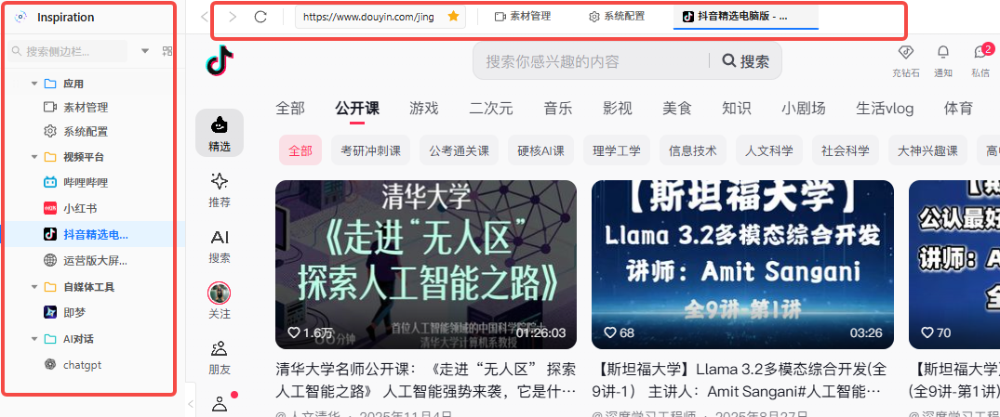
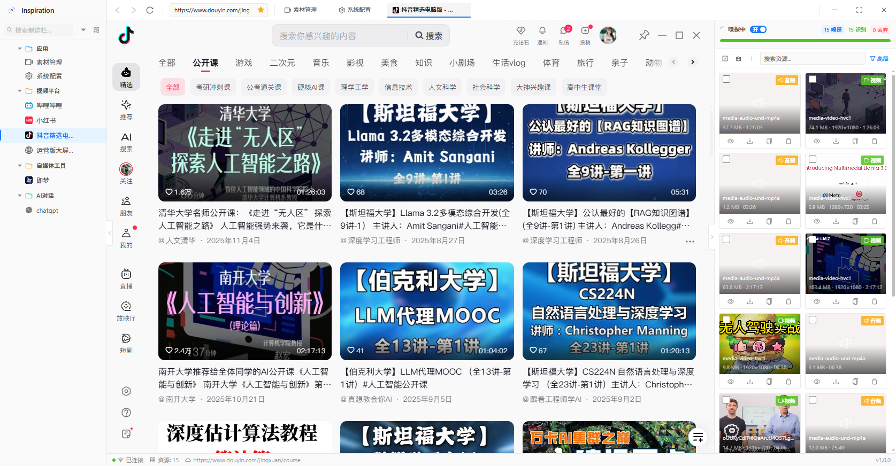
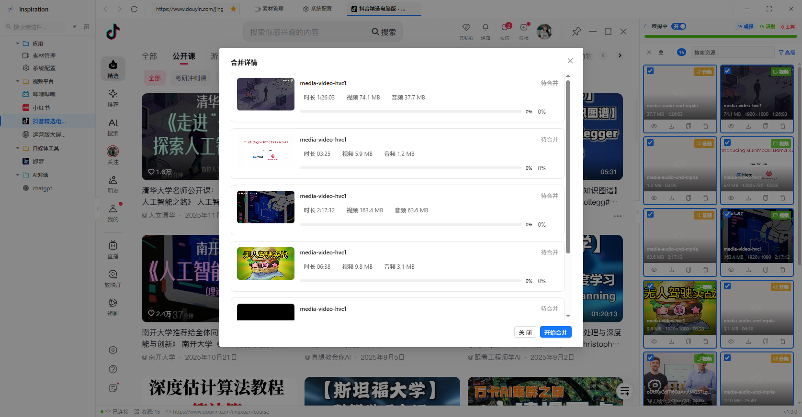
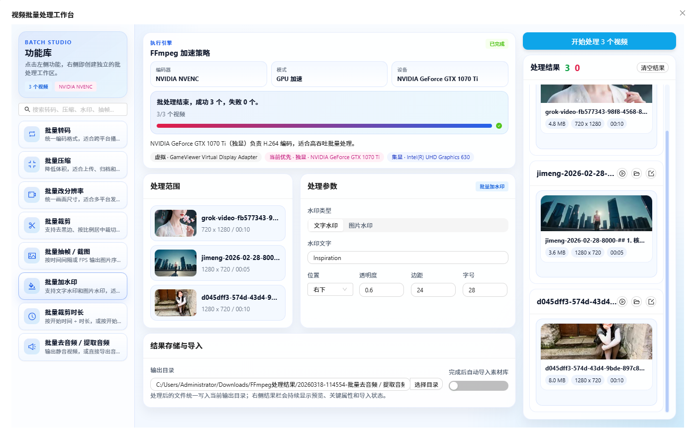
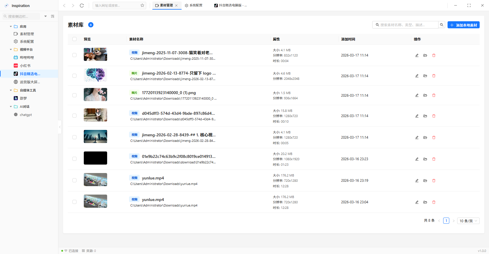

# Inspiration


一个把网页浏览、媒体嗅探、批量下载、批量视频处理和素材沉淀整合在一起的桌面工作台。

Inspiration 基于 Electron + React + TypeScript 构建，适合在浏览网页时快速定位视频、音频和图片资源，并把结果统一管理到本地素材库中。对于已经保存到本地的视频素材，还可以进一步进入批量处理工作台，统一做转码、压缩、裁剪、水印等操作。

## 免责说明

本项目仅供学习、研究和处理你本人有合法访问权、下载权或使用权的资源。

- 只能获取、保存和整理你自己有权限访问的资源
- 不得用于抓取、传播、下载或分发他人无授权内容
- 不得用于任何违法违规、侵权、绕过授权或破坏平台规则的用途
- 使用者应自行遵守目标网站服务条款及所在地法律法规

如果你无法确认某项内容是否具备合法权限，请不要使用本工具对其进行获取、下载或传播。

## 为什么用 Inspiration

- 一个窗口完成浏览、识别、筛选、下载、整理
- 不是只给出链接，而是直接给出可操作的资源卡片
- 支持批量勾选、批量下载和音视频合并处理
- 支持对本地视频素材做批量转码、压缩、裁剪、水印和抽帧
- 下载结果会自动沉淀到素材库，便于后续复用
- 适合把常用平台和常用页面统一纳入一个工作流

## 界面预览

### 浏览器工作台

左侧提供应用导航、收藏夹和平台入口，上方是标签栏与地址栏，适合在一个窗口里连续浏览多个目标站点。



### 视频嗅探面板

在浏览网页的同时，右侧嗅探面板会持续收集页面中的媒体资源，并按资源卡片展示类型、大小、分辨率、时长和常用操作。



### 合并下载

对于拆分音视频的资源，可以在批量选择后进入合并流程，集中查看进度并执行下载或处理。



### 批量视频处理工作台

对于已经下载到本地的视频素材，可以进入独立的 FFmpeg 批量处理工作台，集中完成转码、压缩、改分辨率、裁剪、抽帧、加水印、裁剪时长、去音频或提取音频。



### 素材管理

下载后的资源会沉淀到素材库，便于后续检索、查看属性、跳转本地路径和统一管理。



## 核心能力

### 浏览与导航

- 内嵌浏览器和多标签页
- 地址输入、搜索、前进、后退、刷新
- 收藏夹和平台导航入口

### 媒体资源识别

应用会结合多种方式识别页面中的媒体资源：

- 扫描页面 DOM 中的媒体标签
- 监听网络响应并分析 `Content-Type`
- 结合 URL 后缀和上下文信息做补充判断

当前更适合识别的资源类型包括：

- 视频：`mp4`、`webm`、`m3u8`、`mpd`
- 音频：`mp3`、`aac`、`wav`、`ogg`
- 图片：`jpg`、`png`、`webp`、`gif`、`avif`

### 结果操作

- 实时查看资源列表
- 复制资源链接
- 预览部分媒体内容
- 下载单个资源
- 批量勾选与批量处理
- 对拆分音视频执行合并处理

### 批量视频处理

针对已经落地到本地的视频素材，可以打开批量视频处理工作台，统一执行：

- 批量转码
- 批量压缩
- 批量修改分辨率
- 批量裁剪画面
- 批量抽帧 / 截图
- 批量添加文字或图片水印
- 批量裁剪时长
- 批量去音频或提取音频

批处理过程中会展示执行引擎、进度、结果预览和输出目录，处理结果也可以选择继续导入素材库。

### 本地素材沉淀

- 统一保存已下载素材
- 展示文件预览、大小、分辨率和时长
- 支持检索和管理本地资源

## 安装

### 普通用户

1. 打开 GitHub Releases 页面
2. 下载最新的 Windows 安装包 `inspiration-x.y.z-setup.exe`
3. 双击安装并启动应用

如果 Windows 弹出安全提示，请先确认下载来源、仓库地址和版本号，再决定是否继续安装。

### 开发者

环境要求：

- Node.js 22+
- pnpm 10+
- Windows 环境用于构建 Windows 安装包

安装依赖：

```bash
pnpm install
```

启动开发环境：

```bash
npm run dev
```

执行类型检查：

```bash
npm run typecheck
```

构建生产代码：

```bash
npm run build
```

构建 Windows 安装包：

```bash
npm run build:win
```

## 3 分钟上手

### 1. 打开目标网页

在顶部地址栏输入网址，或通过左侧收藏夹、平台入口进入目标页面。

### 2. 触发真实资源加载

很多资源不会在页面初次打开时立刻出现。建议继续执行实际浏览动作：

- 播放视频
- 切换清晰度
- 翻页或滚动页面
- 打开详情内容

### 3. 在右侧嗅探面板查看结果

嗅探面板会持续展示当前页面识别到的资源，通常可以直接看到：

- 资源类型
- 文件大小
- 分辨率
- 时长
- 缩略图或封面

### 4. 选择后续操作

你可以根据需要执行：

- 复制链接
- 打开预览
- 下载单个资源
- 勾选多个资源后批量下载
- 对拆分音视频执行合并处理

### 5. 在素材库里统一管理

下载完成后，进入素材管理页面查看已保存内容，并继续做检索、定位和整理。

## 典型场景

### 提取网页视频地址

1. 打开目标视频页面
2. 播放视频或触发页面请求
3. 在右侧面板定位视频资源
4. 复制链接或直接下载

### 批量下载页面图片或短视频

1. 打开图文页、列表页或素材页
2. 滚动页面，让更多资源加载出来
3. 在嗅探结果中勾选目标条目
4. 执行批量下载

### 处理音视频分离资源

1. 在结果列表中选择对应的音频和视频资源
2. 打开合并下载窗口
3. 确认待处理条目
4. 执行合并或下载

### 批量处理本地视频素材

1. 在素材库中勾选多个本地视频
2. 打开批量视频处理工作台
3. 选择转码、压缩、水印、抽帧等处理方式
4. 设置输出目录并执行处理
5. 按需将结果继续导入素材库

### 沉淀常用素材

1. 将常用平台加入收藏夹
2. 下载有权限保存的素材
3. 在素材库中持续整理历史资源

## 常见问题

### 为什么页面打开了，但没有嗅探到资源？

常见原因包括：

- 页面资源还没有真正发起请求
- 资源需要播放、点击或滚动后才加载
- 目标内容使用了 DRM 或更强的保护机制
- 页面使用了较严格的反抓取策略
- 当前资源类型不在可识别范围内

建议先尝试刷新页面、触发播放、切换清晰度，或者继续滚动页面后再观察结果。

### 为什么复制出来的链接不能直接打开？

某些站点的媒体资源依赖 `Cookie`、`Referer` 或当前页面会话。即使链接本身是正确的，离开原始浏览环境后也可能出现 403、失效或返回空内容。

### 是否支持所有网站？

不支持。不同网站的资源加载方式差异很大，项目会尽量识别常见公开媒体请求，但不保证适配所有站点。

### 支持哪些平台？

当前更适合优先发布和使用 Windows 版本。项目本身具备跨平台构建能力，但实际可用性仍需要分别验证。

## 注意事项

- 本工具仅应用于你有权访问、保存和使用的资源
- 严禁将本工具用于任何非法用途、侵权用途或未授权内容获取
- 请自行遵守目标网站服务条款及所在地法律法规
- 本项目不承诺适配所有网站
- 不提供 DRM 绕过能力
- 某些站点的资源可能受登录态、请求头和会话环境影响

## 开发信息

项目结构：

```text
src/
  main/        Electron 主进程
  preload/     预加载桥接层
  renderer/    React 渲染进程
  shared/      共享类型与路由定义
images/     项目图标与 README 截图资源
```

技术栈：

- Electron
- React
- TypeScript
- electron-vite
- Ant Design
- tRPC
- Drizzle ORM
- better-sqlite3
- ffmpeg-static

## License

本项目采用半开源的 source-available 许可方式发布。

- 允许查看源码
- 允许个人使用和内部使用
- 默认不允许商用分发、二次售卖和托管服务

详细条款请查看 [LICENSE](./LICENSE)。
